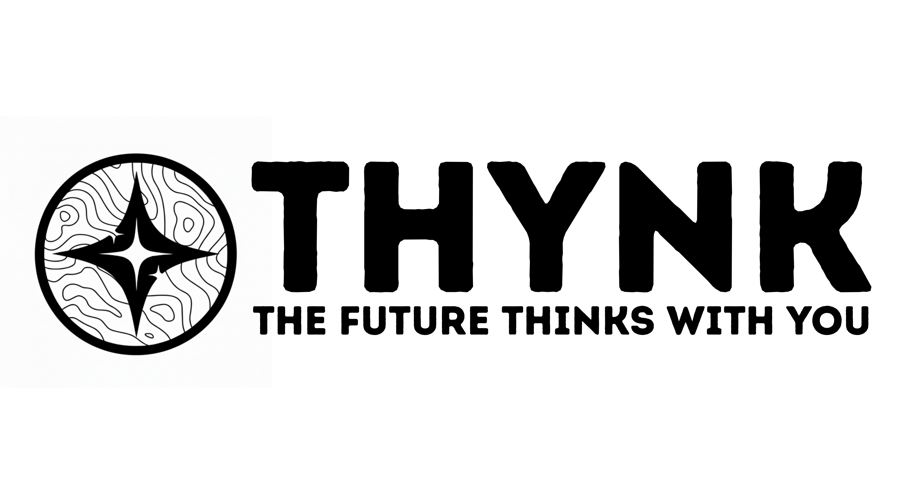

# THYNK - Decentralized Prediction Markets



**Live Demo:** [https://thynk.netlify.app/](https://thynk.netlify.app/)

THYNK is a fully decentralized prediction market platform built on Celo Sepolia testnet, featuring an innovative optimistic oracle system with decentralized jury resolution for disputed outcomes.

## 🌟 Features

### Core Functionality
- **Create Prediction Markets**: Anyone can propose a market by staking 0.1 cUSD
- **Trade Shares**: Buy shares on outcomes (1 share = 1 cUSD)
- **Decentralized Resolution**: Markets are resolved through an optimistic oracle system
- **Dispute Mechanism**: Challenge incorrect outcomes with a jury voting system
- **Juror Staking**: Stake tokens to participate as a juror and earn rewards

### Optimistic Oracle System
1. **Propose**: After market ends, anyone can propose an outcome (requires bond)
2. **Dispute Window**: 5-minute window to dispute the proposed outcome
3. **Jury Selection**: If disputed, 10 random jurors are selected from the staking pool
4. **Jury Voting**: Jurors vote on the correct outcome over 15 minutes
5. **Finalization**: Market resolves based on jury decision, rewards distributed

## 🔧 Technical Details

### Smart Contract Information

**Network:** Celo Sepolia Testnet (Chain ID: 11142220)

**Contract Address:** `0x3a68C64f9d10Fe755e02cF6273cB4603CFf1c398`

**Token Address (cUSD):** `0xdE9e4C3ce781b4bA68120d6261cbad65ce0aB00b`

**Block Explorer:** [Celo Sepolia Explorer](https://explorer.celo.org/sepolia)

### Contract Parameters
- **Market Creation Stake**: 0.1 cUSD (returned if market resolves fairly)
- **Proposal Bond**: 0.1 cUSD (required to propose/dispute outcomes)
- **Minimum Juror Stake**: 0.5 cUSD
- **Dispute Window**: 5 minutes
- **Voting Duration**: 15 minutes
- **Juror Lock Duration**: 15 minutes (after voting)
- **Jury Size**: 10 jurors
- **Slash Percentage**: 10% (for incorrect/non-voting jurors)
- **Treasury Fee**: 30% (from dispute resolution pools)
- **Creator Fee**: 1% (from winning side profits)
- **Treasury Fee (winnings)**: 1% (from winning side profits)

### Market Time Limits
- **Minimum Duration**: 10 minutes
- **Maximum Duration**: 365 days

### Token Decimals
- All tokens use **6 decimals** (cUSD standard on Celo)

## 🏗️ Architecture

### Frontend Stack
- **Framework**: Next.js 14 (App Router)
- **Language**: TypeScript
- **Styling**: Tailwind CSS
- **UI Components**: shadcn/ui
- **Web3 Integration**: thirdweb SDK v5
- **Database**: Supabase (for off-chain metadata)
- **Deployment**: Netlify

### Smart Contract
- **Language**: Solidity ^0.8.13
- **Framework**: Hardhat with zkSync plugins
- **Features**:
  - ERC20 token integration (cUSD)
  - Reentrancy protection
  - Ownable pattern
  - On-chain randomness (blockhash-based, testnet only)

### Key Contract Functions

#### Market Creation
```solidity
function proposeMarket(
    string memory _question,
    string memory _optionA,
    string memory _optionB,
    uint256 _resolutionTimestamp
) external returns (uint256)
```

#### Trading
```solidity
function buyShares(
    uint256 _marketId,
    bool _isOptionA,
    uint256 _amount
) external
```

#### Oracle Resolution
```solidity
function proposeOutcome(uint256 _marketId, MarketOutcome _outcome) external
function disputeOutcome(uint256 _marketId, MarketOutcome _counterOutcome) external
function fetchJurySelection(uint256 _marketId) external
function submitJuryVote(uint256 _marketId, MarketOutcome _votedOutcome) external
function finalizeDispute(uint256 _marketId) external
function finalizeUndisputed(uint256 _marketId) external
```

#### Juror System
```solidity
function stakeForJury() external
function unstakeFromJury() external
function claimJuryRewards(uint256 _marketId) external
```

## 🚀 Getting Started

### Prerequisites
- Node.js 18+ and npm
- MetaMask or compatible Web3 wallet
- Celo Sepolia testnet cUSD tokens

### Installation

1. Clone the repository:
```bash
git clone <your-repo-url>
cd Thynk/thynklabs
```

2. Install dependencies:
```bash
npm install
```

3. Set up environment variables:
```bash
cp .env.example .env
```

Add the following to your `.env` file:
```env
NEXT_PUBLIC_THIRDWEB_CLIENT_ID=your_thirdweb_client_id
NEXT_PUBLIC_SUPABASE_URL=your_supabase_url
NEXT_PUBLIC_SUPABASE_ANON_KEY=your_supabase_anon_key
```

4. Run the development server:
```bash
npm run dev
```

5. Open [http://localhost:3000](http://localhost:3000) in your browser

### Getting Testnet Tokens

1. **Get CELO (for gas)**:
   - Visit [Celo Faucet](https://faucet.celo.org/)
   - Switch to Celo Sepolia testnet
   - Request testnet CELO

2. **Get cUSD**:
   - Use the [Celo Faucet](https://faucet.celo.org/) to get cUSD
   - Or swap CELO for cUSD on a testnet DEX

## 📖 How to Use

### Creating a Market
1. Connect your wallet (MetaMask recommended)
2. Click "Propose Market"
3. Fill in market details:
   - Question
   - Two outcome options (A & B)
   - Resolution time (10 min - 365 days)
   - Description and image
4. Approve 100,000 cUSD (one-time, for multiple markets)
5. Confirm transaction (0.1 cUSD stake required)

### Trading on Markets
1. Browse active markets
2. Click on an option (Option A or Option B)
3. Enter amount to bet
4. Approve token spending (if first time)
5. Confirm purchase

### Becoming a Juror
1. Navigate to the "Juror" page
2. Click "Stake 0.5 cUSD"
3. Approve and confirm transaction
4. You're now eligible to be selected as a juror for disputes

### Resolving Markets
1. **Propose Outcome** (after market ends):
   - Any user can propose the correct outcome
   - Requires 0.1 cUSD bond
   
2. **Dispute** (during 5-minute window):
   - Challenge incorrect proposals
   - Requires 0.1 cUSD bond
   - Triggers jury selection

3. **Jury Vote** (if you're selected):
   - Review both proposed outcomes
   - Vote for the correct outcome within 15 minutes
   - Earn rewards if you vote with the majority

4. **Finalize**:
   - Anyone can call finalize after dispute window or voting ends
   - Market resolves and winners can claim

### Claiming Rewards
- **Traders**: Click "Claim Winnings" on resolved markets
- **Market Creators**: Claim stake + 1% creator fees
- **Jurors**: Claim rewards from successful jury votes


## 🏛️ Governance & Parameters

Contract owner can update:
- Market creation stake amount
- Proposal bond amount

Via the Admin Dashboard at `/admin`

## 📊 Resolution Status Flow

```
PENDING (0)
    ↓ (market ends)
AWAITING_PROPOSAL (1)
    ↓ (someone proposes)
DISPUTE_WINDOW (2)
    ↓ (if disputed)
IN_DISPUTE (3)
    ↓ (jury selected)
JURY_VOTING (4)
    ↓ (voting complete)
FINALIZED (5)
```

Or if not disputed:
```
DISPUTE_WINDOW (2)
    ↓ (5 min passes, no dispute)
FINALIZED (5)
```

## 🛠️ Development

### Project Structure
```
thynklabs/
├── src/
│   ├── app/
│   │   ├── admin/          # Admin dashboard
│   │   ├── juror/          # Juror staking page
│   │   ├── api/            # API routes
│   │   └── page.tsx        # Main market page
│   ├── components/
│   │   ├── ui/             # shadcn/ui components
│   │   ├── marketCard.tsx  # Market display
│   │   ├── propose-*.tsx   # Oracle action components
│   │   └── ...
│   ├── constants/
│   │   └── contract.ts     # Contract addresses & config
│   ├── types/
│   │   └── types.ts        # TypeScript types
│   └── lib/
│       └── supabaseClient.ts
├── public/                 # Static assets
└── ...config files
```

### Build for Production
```bash
npm run build
```

### Lint
```bash
npm run lint
```

## 🤝 Contributing

Contributions are welcome! Please feel free to submit a Pull Request.

## 📄 License

This project is licensed under the MIT License.

## 🔗 Links

- **Live App**: [https://thynk.netlify.app/](https://thynk.netlify.app/)
- **Contract on Explorer**: [View on Celo Sepolia](https://explorer.celo.org/sepolia/address/0x3a68C64f9d10Fe755e02cF6273cB4603CFf1c398)
- **Celo Docs**: [https://docs.celo.org/](https://docs.celo.org/)
- **thirdweb Docs**: [https://portal.thirdweb.com/](https://portal.thirdweb.com/)

## 📧 Support

For issues or questions, please open an issue on GitHub or reach out to the development team.

---

**Built with ❤️ by Team Oddsy on Celo**
